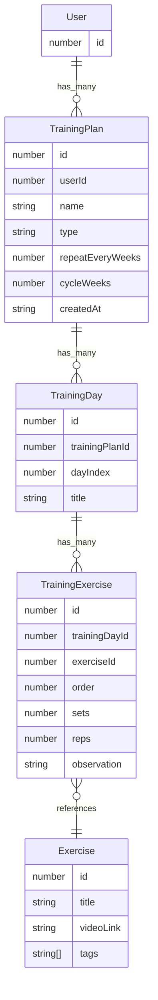

# About
Project for a private workout database

# Technologies being used

Use [nest-userauth](https://github.com/hblado/nest-userauth) as base for authetincation.

# Exercises Relational Diagram

# Plannings

* [ ] All classes and relations
* [ ] All endpoints done
